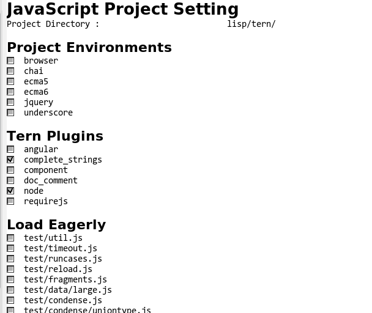

# GUI Front-end for TernJS Project Configuration File

[TernJS](http://ternjs.net/) is a great code-analysis engine for JavaScript.
To bring out the analysis power certainly, you may have to write a project configuration file for the each project.
However, it is little difficult to edit and place it at the project root directory which is determined by tern engine automatically.

Using this program, you can create and edit the configuration file with Emacs GUI quickly.

# Usage

Install ternjs and this program.

Then, `M-x tern-prj-dialog` on a JavaScript buffer, you can visit the configuration buffer.
**Project Directory** is the project root directory determined by ternjs.

Please refer the [documentation](http://ternjs.net/doc/manual.html#configuration) for the configuration items.

Finally, pushing the button `[OK]`, this program writes the configuration file and restarts the ternjs process.

# License

GPL v3

----
(C) 2015 SAKURAI Masashi. m.sakurai at kiwanami.net
